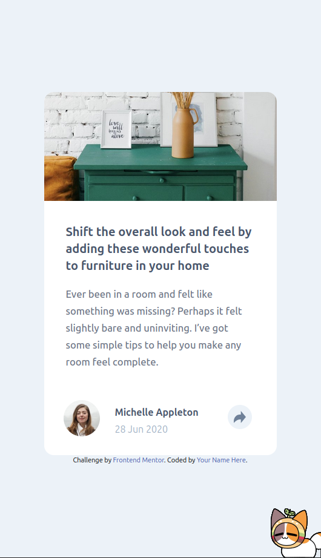

<h1>Frontend Mentor - Article Preview Card</h1>

This is my solution to the Article preview component challenge on Frontend Mentor. The project focuses on building a responsive card UI with a dynamic share tooltip using HTML, CSS (Tailwind), and JavaScript.
📸 Screenshot

    
    <h3>Desktop Design </h3>    

    Ignore Hamborger, She is my Shimeji pet😁️
    
    
    <h3>Desktop Active Design </h3>    

    
    <h3>Mobile Design </h3>    

    
    <h3>Mobile Active Design </h3>    

    
🔗 Live Site

Live Demo
(Replace with your GitHub Pages deployment link)
🛠️ Built With

    Semantic HTML5

    Tailwind CSS

    JavaScript (DOM manipulation)

    Flexbox

    Mobile-first responsive design

✨ Features

    Click interaction to toggle the share panel
    
    Timeout of 3 second for desktop share

    Responsive layout for both desktop and mobile

    Accessible aria-labels for better usability

    Clean UI with dark tooltip and icon buttons

💡 What I Learned

    How to toggle visibility of elements using JavaScript and Tailwind utility classes.

    Managing event listeners for conditional interaction (click, blur, etc.)

    Using absolute, relative, and z-index effectively for popups.

    Creating reusable utility classes in Tailwind for consistent spacing and design.

🚀 Continued Development

    Add closing the tooltip when clicking outside.

    Improve keyboard accessibility (ESC to close).

    Add animation for share panel open/close.

    Refactor with reusable components or frameworks (React/Vue).

📚 Useful Resources

    Tailwind Docs – Position Utilities

    JavaScript DOM Events

    Frontend Mentor Solution Gallery

👤 Author

    Frontend Mentor – @meowmeowrahul

    GitHub – @meowmeowrahul

🙌 Acknowledgments

Thanks to Frontend Mentor for creating such realistic challenges that help sharpen both design and JavaScript interaction skills.
